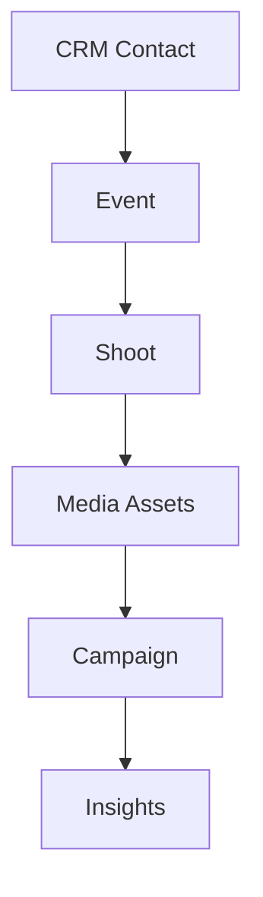

# FashionOS Architecture

## 🧠 Mental Model: The 3-Panel System

### Left: Context
- Purpose: Navigation and Domain switching.
- Scale: Enables effortless management of multiple brand layers (DNA, Shoots, Events).

### Main: Work
- Purpose: High-fidelity focus area for human creation and review.
- Philosophy: Human-first execution aided by AI tools.

### Right: Intelligence
- Purpose: Proactive AI-driven insights, collaborative monitoring, and risk management.
- Integration: Gemini Flash 3.0 provides real-time trend analysis and "Style Compliance" audits.

## 🗺️ Diagrams

### Universal System

### Fashion Workflow

## AI Strategy
FashionOS uses Gemini Flash 3.0 for:
1. **Trend Resonance:** Analyzing current SS25 performance vs Brand DNA.
2. **Conflict Detection:** Identifying overlaps in shoot calendars and event venues.
3. **Strategic Audits:** Ensuring all "Critical Path" tasks align with the season's aesthetic goals.
