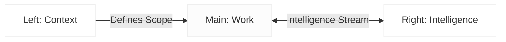
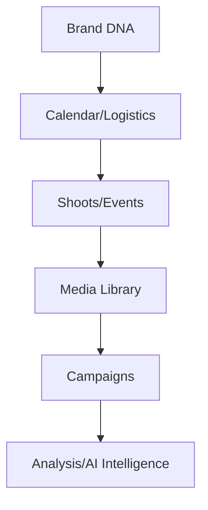

# FashionOS Product Overview

FashionOS is an intelligent operating system designed for high-end fashion brands, agencies, and event organizers. It streamlines the complexities of brand management, campaign execution, and creative workflows through a premium, AI-augmented interface.

---

## 🚀 Product Definition
**FashionOS** acts as a "Neural Maison Partner," providing a calm, luxury workspace that balances human creativity with proactive artificial intelligence.

- **Value Proposition:** Centralizing brand DNA, media assets, and campaign logistics into a single, cohesive 3-panel system.
- **Target Audience:** Luxury fashion houses, creative directors, PR agencies, and production managers.

---

## 🛠️ Technical Stack

| Category | Technology | Version |
| :--- | :--- | :--- |
| **Core Framework** | React (via esm.sh) | ^19.2.3 |
| **Language** | TypeScript | Latest |
| **Styling** | Tailwind CSS | Latest (JIT via Script) |
| **Icons** | Lucide React | ^0.562.0 |
| **Data Visualization** | Recharts | ^3.6.0 |
| **Intelligence** | Google Gemini API (@google/genai) | ^1.34.0 |
| **Runtime** | ES Modules / Browser Native | - |

---

## 📂 Directory Structure

```text
.
├── App.tsx                 # Application Composition Root & Layout
├── index.html              # Entry HTML with Import Maps
├── index.tsx               # Bootstrapper
├── metadata.json           # App Permissions & Metadata
├── types.ts                # Global Type Definitions
├── components/
│   ├── Sidebar.tsx         # Left Panel: Navigation & Context
│   └── IntelligencePanel.tsx # Right Panel: AI & Proactive Insights
├── pages/
│   └── Dashboard.tsx       # Main Panel: Core Work Area
├── services/
│   └── geminiService.ts    # AI Logic & Gemini API Integration
└── docs/
    └── 01-overview.md      # Product Documentation
```

---

## 🗺️ Sitemap & Navigation

FashionOS uses internal state-based routing to navigate between specific "Domains":

1.  **Dashboard (Active)**: High-level KPIs, DNA Index, and Critical Path.
2.  **CRM**: Talent, Press, and Buyer management.
3.  **Analysis**: Media resonance and performance tracking.
4.  **Profile**: Centralized Brand DNA and Style Guidelines.
5.  **Calendar**: Event, shoot, and campaign scheduling.
6.  **Shoots**: Shot lists, call sheets, and logistics.
7.  **Events**: Runway shows, galas, and run-of-show.
8.  **Campaigns**: Marketing and PR execution timelines.
9.  **Media**: Digital Asset Management (DAM).
10. **Concierge**: Context-aware AI assistant.
11. **Settings**: Permissions and System configuration.

---

## 🏗️ System Architecture

### 1. The 3-Panel Model
FashionOS adheres to a strict UX architecture to prevent cognitive overload:



### 2. Information Flow
The workflow moves from strategic planning to asset production and finally to analysis.



---

## 🔄 Core Workflows

### AI-Augmented Production
1.  **Initialize**: User creates a new Shoot or Event in the **Main Panel**.
2.  **Context Sync**: The **Left Panel** filters navigation to relevant assets.
3.  **Intel Assist**: The **Right Panel** (Gemini) automatically scans for conflicts, suggests call sheet priorities, or audits "Style Compliance" against the Brand DNA.
4.  **Execute**: Humans perform creative work; AI handles the metadata and risk monitoring.

### Market Resonance Tracking
1.  **Observe**: Real-time signals are displayed in the Dashboard via Recharts.
2.  **Analyze**: Gemini API processes "Market Drift" (how far the current media is from the core Brand DNA).
3.  **Pivot**: Intelligence Panel suggests strategic actions (e.g., "Shift distribution to EMEA" or "Audit SS25 momentum").

---

## 🎨 UI/UX Design System

- **Typography**: 
    - *Serif*: Playfair Display (Luxury, Headlines).
    - *Sans*: Inter (Utility, Data, System info).
- **Color Palette**: 
    - `Base`: #FCFCFC (Calm, Premium).
    - `Accent`: #000000 (Authoritative).
    - `Signal`: Emerald (Active/Healthy), Amber (Warning), Rose (Critical).
- **Principles**: 
    - **Clarity Over Noise**: Minimal borders, generous white space.
    - **AI as a Peer**: Intelligence lives in its own space, never obscuring human work.
    - **Motion**: Subtle transitions (0.2s - 0.3s) for panel interactions.
