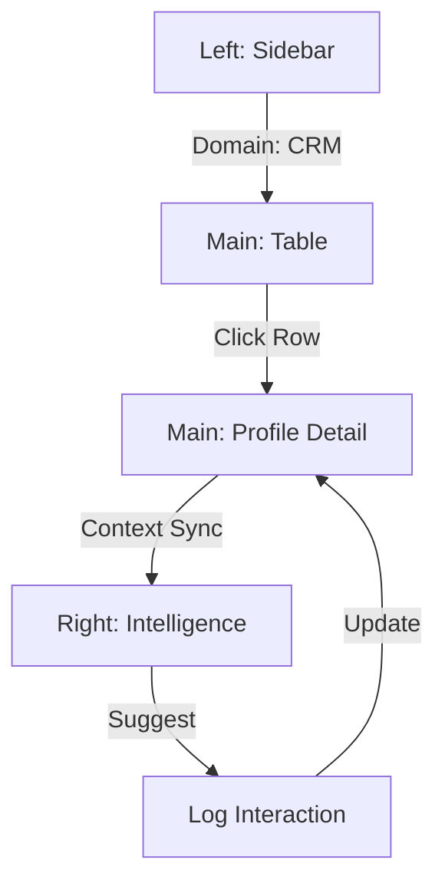
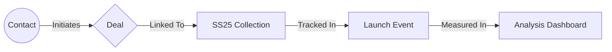
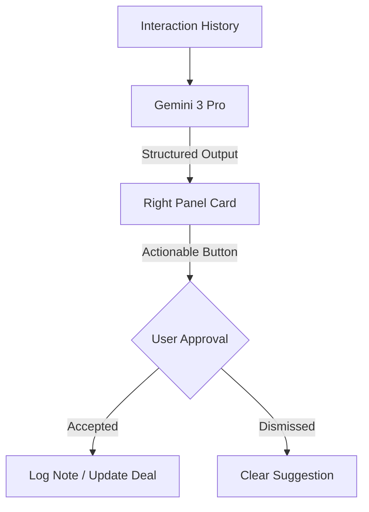

# 🧠 FashionOS CRM Upgrade Plan

**Status:** READY / NOT READY (Pending Initial Execution)  
**Version:** 1.0.0  
**Architect:** Senior Product Architect (AI)

---

## 1. Executive Summary
This document outlines the strategic roadmap to transform the current FashionOS CRM from a static table into a dynamic, AI-augmented relationship management system. By leveraging the **3-Panel System**, we ensure high-fidelity focus on partner relationships while utilizing **Gemini 3 Pro** for proactive intelligence (RSVP tracking, media placement audits, and deal forecasting).

---

## 2. Fashion-Specific Feature Breakdown

| Feature | Description | AI Interaction |
| :--- | :--- | :--- |
| **Deep Profiles** | Full dossier on Designers, Buyers, and Press. | Summary of last 3 interactions. |
| **Show RSVP Tracker** | Monitoring invitation states (Invited → Confirmed → Attended). | Conflict detection with other show dates. |
| **Media Placement Log** | Tracking brand appearances in Vogue, Harper's, etc. | Sentiment analysis of press clips. |
| **Pipeline 2.0** | Deals linked directly to specific Collections (e.g., SS25). | Probability scoring based on historical RSVP data. |
| **Global Handshakes** | Unified interaction history across email, notes, and events. | Extraction of key action items from notes. |

---

## 3. Agentic Workflow Strategy

To execute this CRM, we utilize a multi-agent swarm:
- **Orchestrator:** Manages the state between the Contact List (Main) and the Intelligence Panel (Right).
- **Analyst:** Computes "Relationship Health" scores based on interaction frequency.
- **Extractor:** Uses Gemini to pull structured contact data from messy text notes or PDFs.
- **Controller:** Ensures AI-suggested follow-ups are only sent after user approval.
- **Retriever (RAG):** Searches previous season contracts to provide context for new deals.

---

## 🪜 4. Multi-Step Implementation Plan

### Prompt 1: Data Model & Type Alignment
- **Goal:** Update the structural foundation to support complex relationships.
- **Files:** `types.ts`, `pages/CRM.tsx` (Mock Data).
- **Logic:** Expand `Contact` type to include `deals`, `interactionHistory`, `socials`, and `rsvpHistory`.
- **Validation:** Application compiles without type errors.

### Prompt 2: Advanced Filtering & List UI
- **Goal:** Implement the "Advanced Filtering" HUD in the Main Panel.
- **UX:** Add visual chips for Categories (Designer/Buyer/Press/Sponsor) and Status (Active/Lead/Archive).
- **Validation:** Clicking a chip instantly filters the visible rows.

### Prompt 3: Selection State & Detail View Layout
- **Goal:** Transition from a list view to a detail view upon row click.
- **UX:** Maintain the 3-panel layout. The Main panel splits into a "Contact Profile" view.
- **Validation:** Selecting "Sarah Jenkins" replaces the table with her personal dossier.

### Prompt 4: Interaction History & Logs
- **Goal:** Build the timeline of logs in the Main Detail View.
- **UI:** A vertical thread of RSVPs, notes, and press placements.
- **Validation:** Users can see "Show Guest List Updated" and "Contract Signed" chronologically.

### Prompt 5: Deals & Collection Linking
- **Goal:** Integrate a "Deals" section within the Contact Profile.
- **Feature:** Fields for value, stage, and a dropdown to link to a "Campaign" or "Collection".
- **Validation:** A deal can be marked as "Negotiation" and linked to "SS25 Paris".

### Prompt 6: Intelligence Panel CRM Injection
- **Goal:** Move the compact Pipeline and Handshake views to the Right Panel.
- **Logic:** When `activeItem === 'CRM'`, the Intelligence panel shows context-aware deal summaries.
- **Validation:** Right panel updates dynamically when a new contact is selected in Main.

### Prompt 7: Add Contact Modal (The "Onboarding" Wizard)
- **Goal:** Create a high-end modal for data entry.
- **UX:** Use a floating overlay with fashion-relevant fields (Brand DNA fit, Tier, Preferred City).
- **Validation:** Form submission adds a new item to the state/list.

### Prompt 8: Stats Grid Sparklines
- **Goal:** Add visual momentum to the CRM header cards.
- **UI:** Integrate a small Recharts `AreaChart` into the "Network Size" and "Press Reach" cards.
- **Validation:** Charts render accurately within the compact card bounds.

### Prompt 9: Gemini Service Expansion (Structured Insights)
- **Goal:** Connect CRM data to the Gemini API for "Relationship Summaries".
- **AI:** `gemini-3-flash-preview` analyzes a contact's history and suggests "Next Best Action".
- **Validation:** "AI Strategic Actions" in the Right panel show personalized suggestions for the selected contact.

### Prompt 10: Final UX Polish & Animation
- **Goal:** Ensure "Luxury Calm" through motion.
- **UI:** Add Framer Motion (or simple CSS transitions) for panel sliding and list filtering.
- **Validation:** No layout shifts; system feels responsive and premium.

---

## 📊 5. Progress Tracker

| Step | Prompt | Feature | Risk | Status |
| :--- | :--- | :--- | :--- | :--- |
| 1 | Data Model | Extended Types | Low | ⏳ PENDING |
| 2 | Filtering | Category HUD | Low | ⏳ PENDING |
| 3 | Profile View | Detail Navigation | Medium | ⏳ PENDING |
| 4 | History | Interaction Logs | Low | ⏳ PENDING |
| 5 | Deals | Linked Collections | Medium | ⏳ PENDING |
| 6 | Intel Panel | CRM Context | Medium | ⏳ PENDING |
| 7 | Modal | Add Contact Wizard | Low | ⏳ PENDING |
| 8 | Stats | Recharts Sparklines | Low | ⏳ PENDING |
| 9 | AI Logic | Relationship pivots | High | ⏳ PENDING |
| 10 | Polish | Luxury Transitions | Low | ⏳ PENDING |

---

## 🧪 6. Validation & Testing Plan

- **List Performance:** Verify smooth scrolling with 100+ contacts.
- **Empty States:** Ensure "No interactions logged yet" displays gracefully for new contacts.
- **AI Safety:** Verify that Gemini suggestions in the Right panel require a "Confirm" click before updating data.
- **Accessibility:** Ensure the "Add Contact" modal is keyboard accessible (ESC to close, Tab to navigate fields).

---

## 🧾 7. Production-Ready Checklist

- [ ] All `NavigationItem` states are handled.
- [ ] Tailwind utility classes are used exclusively (no inline styles).
- [ ] Gemini API calls use `maxOutputTokens` and `thinkingBudget` appropriately for reasoning tasks.
- [ ] Lucide icons are sized consistently (14px or 18px).
- [ ] Responsive design: Right panel hides gracefully on mobile/tablet.
- [ ] Mock data covers all Categories (Designer, Buyer, Press, Sponsor).

---

## 🗺️ 8. Mermaid Diagrams

### 1️⃣ CRM 3-Panel Interaction Flow

### 2️⃣ Contact → Deal → Campaign Flow

### 3️⃣ AI Suggestion Lifecycle

---

## 🏁 9. Final Assessment
**READY FOR EXECUTION:** Yes.  
The system architecture follows the strict 3-panel guidelines and utilizes the latest Gemini capabilities for fashion-specific intelligence. Implementation should begin with **Step 1 (Data Model)** to ensure stable foundations.