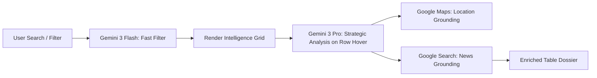

# 📊 FashionOS Advanced CRM Table: Intelligence Grid Design

**Version:** 1.0.0 (Agentic Grid Phase)  
**Status:** 🗺️ PLANNING PHASE (Non-Implementation)  
**Objective:** To define the core logic and interface for the most advanced relationship table in the luxury industry, leveraging the full power of the Gemini 3 ecosystem.

---

## 🖥️ 1. Screen Architecture: The "Fluid Grid"

The CRM Table is the "Work" engine of the Main Panel. It must handle high-density data without sacrificing the "Quiet Luxury" aesthetic.

### Visual Principles
- **Aesthetic:** Virtualized, high-performance grid with subtle micro-interactions.
- **Density Controls:** Three modes — *Dossier* (High Detail), *Standard* (Balanced), and *Compact* (Maximum Data).
- **Infinite Intelligence:** Rows are not static; they breathe with real-time AI updates.

### Column Anatomy
- **The Identity Node:** Avatar + Name + Tier Badge.
- **The Health Signal:** 0-100 score powered by **Gemini 3 Pro**.
- **The Market Pulse:** Sparklines of press mentions (via Recharts).
- **The Last Handshake:** Semantic summary of the latest interaction.
- **RSVP Logic:** Color-coded status for upcoming show seasons (SS25/AW25).

---

## 🚀 2. Core Advanced Features

| Feature | Technical Lever | AI Capability |
| :--- | :--- | :--- |
| **Deep Research Drawer** | Gemini 3 Pro | **Deep Research** mode to build a 360° profile in seconds. |
| **Semantic Filtering** | Gemini 3 Flash | Filter by intent (e.g., "Find buyers who prefer sustainable luxury"). |
| **Market Grounding** | Google Search | Real-time news grounding directly in the table row. |
| **Proximity Logistics** | Google Maps | Calculate "Showroom-to-Show" travel times for RSVP management. |
| **Contract Extraction** | URL Context Tool | Extract deal terms from a PDF link/URL into structured table columns. |
| **Financial Forecasting** | Code Execution | Execute Python logic to project deal ROI across multi-currency pipelines. |

---

## 🤖 3. AI Agents & Workflows

### A. The "Enrichment Sentinel" (Gemini 3 Flash + Search)
- **Role:** Monitors the web for "Handshake Signals."
- **Logic:** Periodically scans for press mentions or career changes for everyone in the grid.
- **Trigger:** Table re-renders or manual "Neural Refresh."
- **Output:** Updates the "Market Pulse" column with verified citations.

### B. The "Strategic Architect" (Gemini 3 Pro + Thinking)
- **Role:** Performs complex reasoning on relationship health.
- **Logic:** Uses **Gemini Thinking** to analyze years of history and project if a partner is "cooling off."
- **Output:** Triggers a "Strategic Warning" icon in the table with a suggested recovery action.

### C. The "Logistics Coordinator" (Function Calling + Maps)
- **Role:** Managing RSVPs for Paris Fashion Week.
- **Logic:** Uses **Function Calling** to check the brand's master calendar and **Google Maps** to see if a partner can realistically make it between venues.
- **Output:** Auto-suggests a private viewing slot if a show conflict is detected.

---

## 🔁 4. Advanced Logic & Automations

### Workflow: The "Career Pivot" Sync
1. **Detection:** Grounding with Google Search finds that a "Senior Buyer" at Harrods has moved to Selfridges.
2. **Analysis:** Gemini 3 Pro reasons: "This changes the Harrods node to 'Void' and creates a new 'Tier I' Lead at Selfridges."
3. **Action:** The table highlights the Harrods row in Amber and creates a new "Suggested Lead" row for the user to approve.

### Workflow: Bulk Deal Simulation
1. **User Action:** Selects 10 rows in the grid.
2. **AI Action:** User asks: "What is the projected revenue if we close all these deals by SS25?"
3. **Execution:** **Code Execution** runs a probability-weighted model on the selected deals.
4. **Output:** A floating AI card summarizes the findings with a confidence interval.

---

## 🎭 5. Real-World Use Cases

### Use Case A: PR Crisis Mitigation
- **Scenario:** A controversial placement occurs in a secondary market.
- **AI Action:** **Structured Output** agents scan social signals. The CRM Table highlights the affected "Press" contacts and suggests a pre-written clarification brief tailored to each editor's tone.

### Use Case B: The "High-Net-Worth" Discovery
- **Scenario:** Identifying new sponsors for a Gala.
- **AI Action:** **Deep Research** agent scours recent luxury philanthropic reports.
- **Result:** New rows are added to the table, enriched with **Google Search** citations and **LinkedIn** context.

---

## ✅ 6. Success Criteria for Implementation
- **Zero Lag:** 1000+ rows scroll at 60fps.
- **Verification:** Every AI-enriched field has a "Source Icon" linking to the grounding chunk.
- **Human Agency:** AI can suggest "Status Promotes," but never commits them without a click.
- **Clarity:** The "Relationship Vitality" score feels intuitive and grounded in data, not hallucination.

---

## 🗺️ Mermaid Logic: The Intelligence Pipeline
