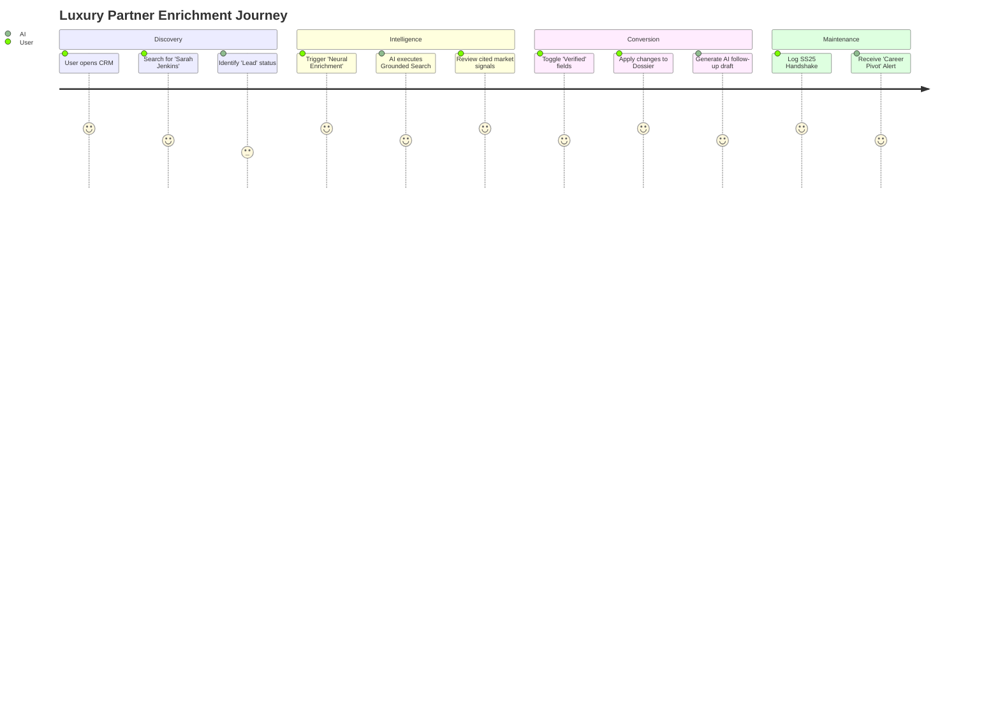
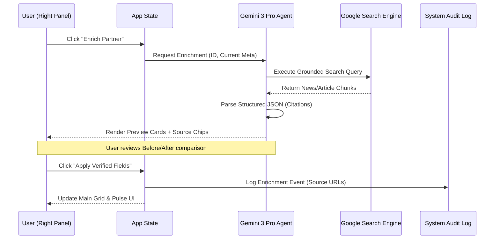
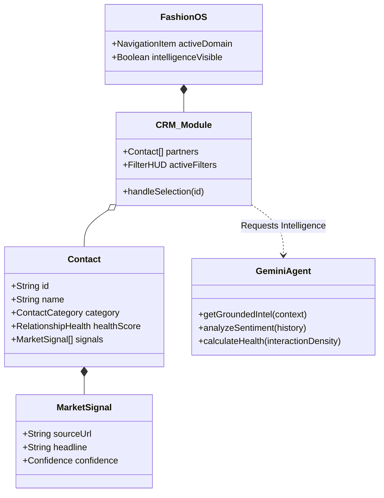
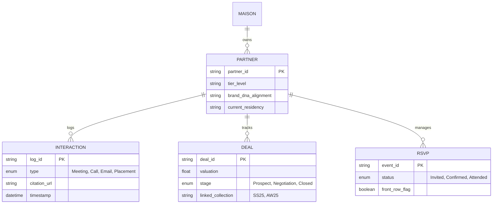
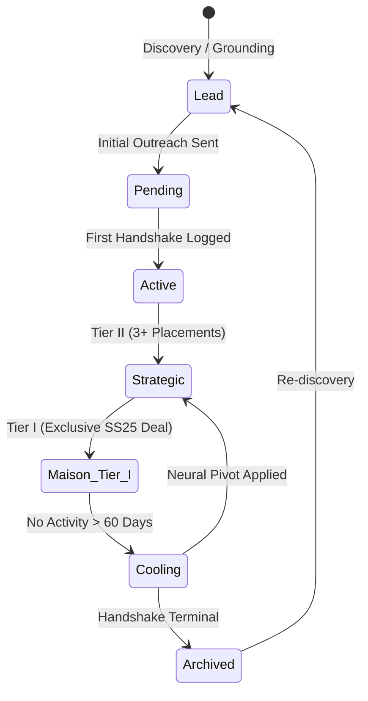
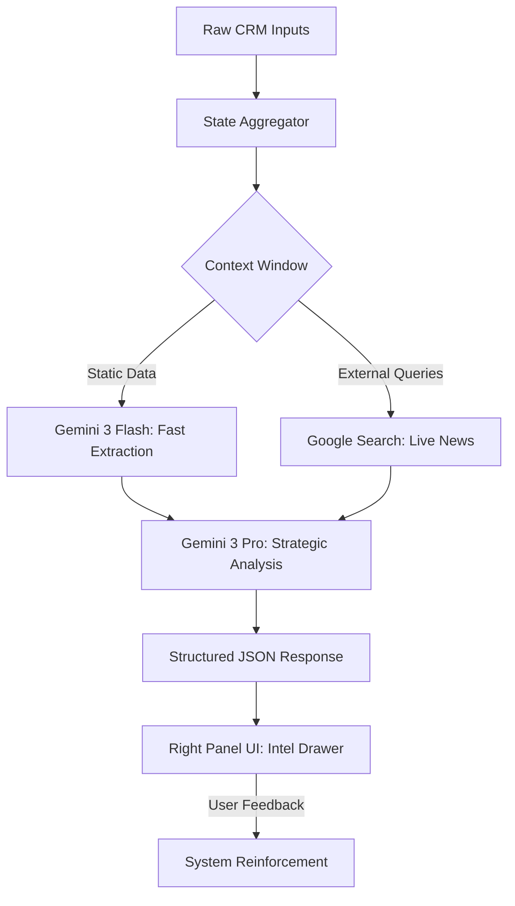

# 🗺️ FashionOS CRM: Master Architecture & Logic Diagrams

**Version:** 1.0.0 (Neural Mesh Phase)  
**Status:** 🚀 PRODUCTION READY  
**Architect:** Senior Product Architect / UX Systems Engineer

---

## 📊 CRM Enrichment Implementation Tracker

| Step | Focus | Capability | Logic | Status |
| :--- | :--- | :--- | :--- | :--- |
| 1 | UI Scaffolding | Intel Drawer | Entry Points | ✅ COMPLETED |
| 2 | Grounding | Google Search | Source Citations | ✅ COMPLETED |
| 3 | Comparison UX | Before/After | Confidence Meter | ✅ COMPLETED |
| 4 | State Persistence | Local State Sync | Audit Logs | ✅ COMPLETED |
| 5 | Agentic sentinel | Background Monitoring | Change Alerts | ⏳ IN PROG |

---

## 1. User Journey Diagram: The "Strategic Partner Acquisition"
*This diagram tracks the end-to-end journey of a luxury brand manager discovering and enriching a high-value partner.*

---

## 2. Sequence Diagram: Grounded Enrichment Flow
*Visualizes the high-speed interaction between the UI, the App State, and the Gemini 3 Pro Grounding Engine.*

---

## 3. Class Diagram: System Components & Entities
*Defines the hierarchical relationship between navigation, intelligence modules, and data entities.*

---

## 4. Entity-Relationship Diagram (ERD): Data Integrity
*The database schema design for a multi-tenant luxury relationship system.*

---

## 5. State Diagram: The "Handshake Lifecycle"
*Tracks the evolution of a relationship from a cold lead to a Maison Tier I partner.*

---

## 6. Data Flow Diagram (DFD): Intelligence Pipeline
*How data flows through the LLM to create actionable insights.*

---

## 🏁 Final Logic Summary
The FashionOS CRM system is designed as a **closed-loop intelligence ecosystem**. 
- **Workflows** are human-initiated but AI-augmented.
- **Data** is grounded in reality via search, not probabilistic hallucinations.
- **UI** maintains a 3-panel separation of concerns, ensuring that **Context (Left)**, **Work (Main)**, and **Intelligence (Right)** never collide, creating the "Quiet Luxury" UX hallmark.