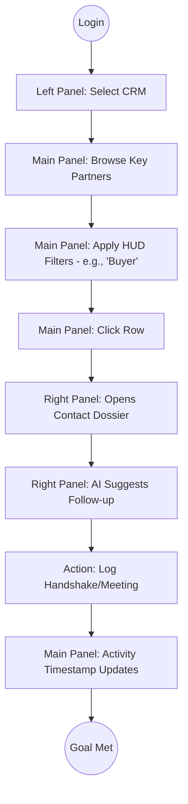
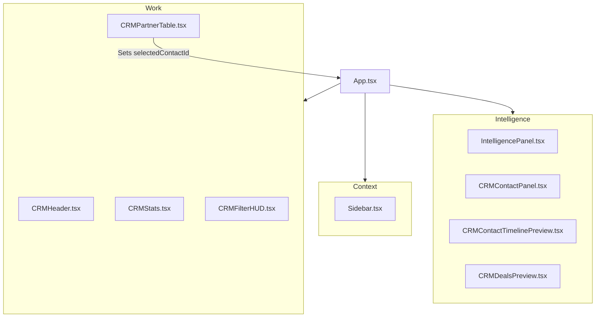
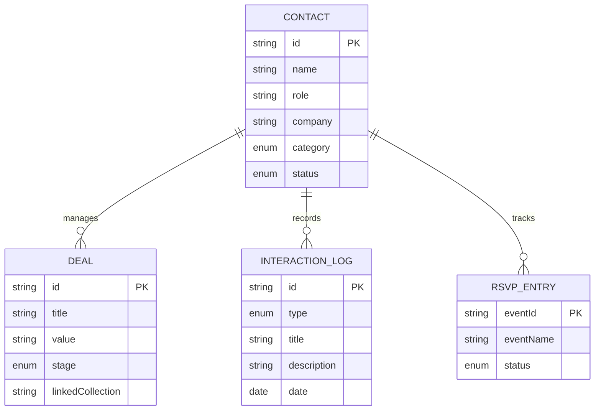
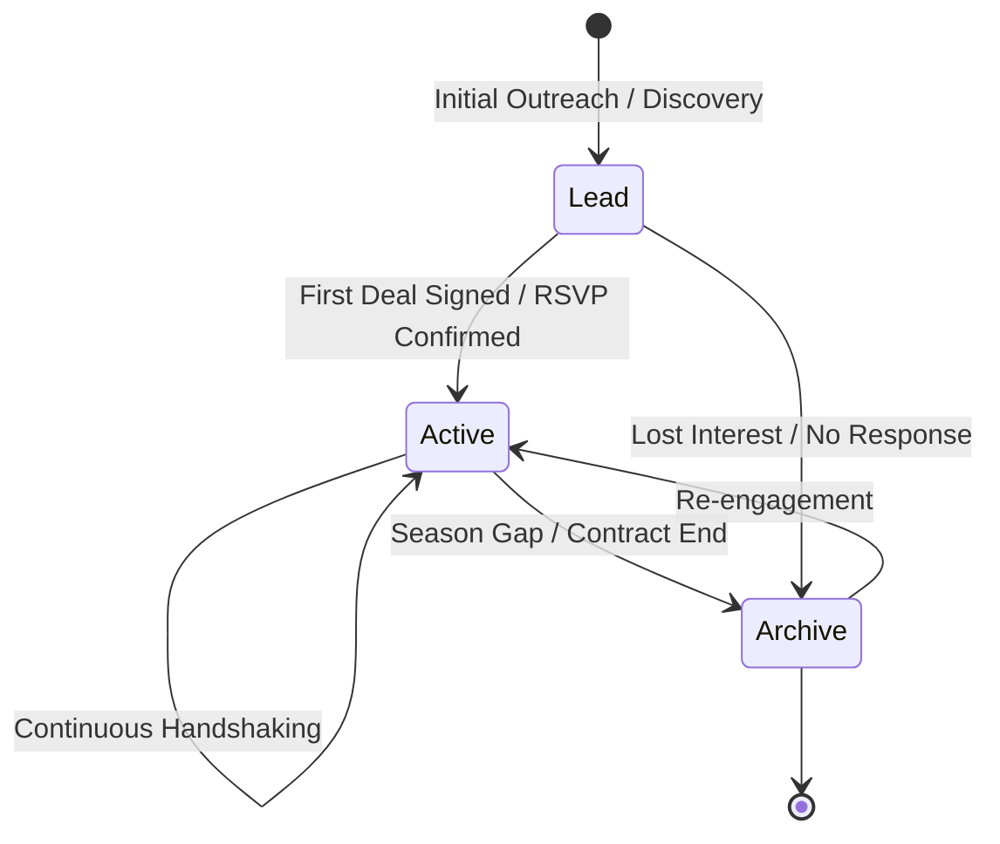
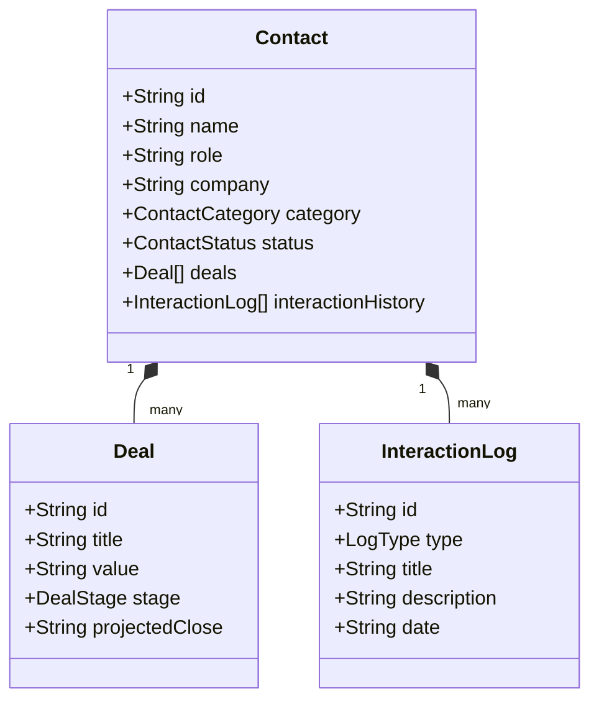
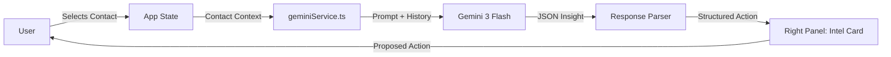

# 🗺️ FashionOS CRM: Architectural & Logic Diagrams

This document provides a technical and visual blueprint of the FashionOS CRM system, illustrating the flow of data, state transitions, and entity relationships.

---

## 1. User Journey: Relationship Management Workflow
*Description: This flow describes the typical human-in-the-loop journey of managing a luxury partnership, from discovery to AI-assisted follow-up.*

---

## 2. System Structure (3-Panel Architecture)
*Description: A high-level view of how the React component tree maps to the physical 3-panel layout of the OS.*

---

## 3. Entity-Relationship (ER) Model
*Description: Defines the relational logic between contacts, their financial deals, and their interaction history.*

---

## 4. State Diagram: Contact Lifecycle
*Description: Visualizes the progression of a contact through the brand's network lifecycle.*

---

## 5. UML Class Diagram: Data Contracts
*Description: A structured representation of the TypeScript interfaces used to enforce data integrity.*

---

## 6. Data Flow Diagram (DFD): AI Intelligence Loop
*Description: Shows how raw CRM data is processed by the Gemini API to return actionable insights to the Right Panel.*

---

## 🏁 Summary
These diagrams confirm that FashionOS is built on a **Modular, Relational, and Agentic** foundation. The 3-panel architecture is not just a UI choice but a structural enforcement of context-aware work.