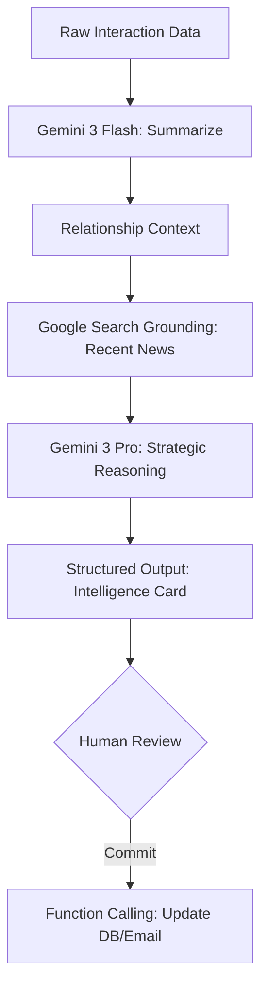

# 🧠 FashionOS Advanced CRM: System Design & AI Logic

**Version:** 2.0.0 (Agentic Expansion)  
**Status:** 🗺️ PLANNING PHASE (Non-Implementation)  
**Objective:** To design a high-fidelity, intelligent relationship engine for luxury fashion using the full suite of Gemini 3 capabilities.

---

## 🖥️ 1. Screens & UI/UX Architecture

The CRM adheres strictly to the **FashionOS 3-Panel System**, ensuring a "Contextual Flow" that minimizes cognitive load for creative professionals.

### 🟦 Left Panel: Contextual Navigation
*   **Domain Switcher:** CRM (Active), Leads, Deals, Archive.
*   **Tier Filters:** Tier I (Maison Partners), Tier II (Strategic), Tier III (Transactional).
*   **Quick Search:** Command-K interface for instant partner retrieval.

### 🟩 Main Panel: The Work Canvas
*   **The Network Grid:** A high-performance, virtualized table for managing 1000+ partners.
*   **The Dossier (Active Selection):** Detailed view appearing when a contact is selected, featuring the "Global Handshake" timeline.
*   **Relationship HUD:** Real-time stats showing deal progress, RSVP status, and placement history.

### 🟨 Right Panel: Intelligence & Agentic Stream
*   **Health Meter:** A visual 0-100 score of relationship vitality.
*   **AI Suggestion Cards:** Proactive follow-ups, conflict warnings, and strategic pivots.
*   **Market Signals:** Real-time news grounding for the selected partner.

---

## 🚀 2. Core Advanced Features

| Feature | Technical Lever | AI Capability |
| :--- | :--- | :--- |
| **Strategic Health Scoring** | Gemini 3 Pro | Complex reasoning over weighted interaction history. |
| **Real-time News Grounding** | Google Search | Fetches recent press/news for partners (e.g., career moves). |
| **Showroom Mapping** | Google Maps | Visualizes partner HQs and showroom proximity for Paris Fashion Week. |
| **Contract Summarization** | URL Context Tool | Analyzes shared lookbook links or contract PDFs for key terms. |
| **Automated Deal Math** | Code Execution | Calculates multi-currency commissions and ROI for agency deals. |
| **Sentiment Audit** | Gemini 3 Flash | Rapidly scans press mentions for brand sentiment (Positive/Neutral/Negative). |

---

## 🤖 3. AI Agents & Automations (Gemini Swarm)

### A. The "Strategic Orchestrator" (Gemini 3 Pro)
*   **Role:** Analyzes the totality of a relationship.
*   **Logic:** Uses **Gemini Thinking** to process high-dimensional data (past RSVPs, placement quality, and market trends) to suggest whether a partner should be promoted to "Tier I".
*   **Output:** Structured JSON for the "Strategic Pivot" card.

### B. The "Market Sentinel" (Gemini 3 Flash + Grounding)
*   **Role:** Real-time external monitoring.
*   **Logic:** Executes **Google Search** queries every time a partner is selected to find "Recent handshakes" or "Competitive alignments".
*   **Output:** A "Morning Brief" style summary in the Intelligence panel.

### C. The "Handshake Controller" (Function Calling)
*   **Role:** Bridging AI thought to system action.
*   **Logic:** When the user clicks "Draft Follow-up", the agent uses **Function Calling** to retrieve the last meeting's action items and pre-fill a high-end email template.

---

## 🔁 4. Workflows & System Logic

### Workflow: The "Paris Fashion Week" RSVP Loop
1.  **Trigger:** User sends invitations to 500 partners.
2.  **Detection:** Agent monitors incoming emails/RSVPs via **Interactions API**.
3.  **Conflict Scan:** **Gemini 3 Pro** identifies overlaps with competing show times (using Search Grounding).
4.  **Alert:** Right Panel warns: *"Harrods Buyer has a conflict with Chanel; suggest moving their private viewing to Thursday 10:00."*
5.  **Resolution:** User clicks "Propose Change"; agent drafts the correction.

### Workflow: Lead-to-Deal Pipeline
1.  **Lead Capture:** User pastes a LinkedIn URL.
2.  **Extraction:** **URL Context Tool** pulls name, role, and company.
3.  **Grounding:** **Google Maps** finds their HQ location for logistics.
4.  **Proposal:** Agent generates a "Partnership Pitch" based on existing Brand DNA profile.

---

## 🎭 5. Real-World Use Cases

### Use Case A: The "Editor Move" Crisis
*   **Scenario:** A key editor at Vogue France moves to a competitor.
*   **AI Action:** **Google Search Grounding** detects the LinkedIn update. The Right Panel immediately signals a **Warning**: *"Loss of Tier I Press Influence detected. Strategic Action: Immediate outreach to new replacement."*

### Use Case B: The "ROI Audit"
*   **Scenario:** Managing a multi-market influencer campaign.
*   **AI Action:** **Code Execution** processes placement data vs. wholesale lift in those regions.
*   **Result:** A generated chart showing which partners provided the highest "Luxury Resonance".

---

## 🏁 6. Success Criteria & Validation
*   **Stability:** 3-Panel layout never shifts during AI processing.
*   **Clarity:** AI suggestions are clearly labeled "Proposals" (Human-First).
*   **Accuracy:** Health scores are grounded in verifiable interaction logs, not hallucinations.
*   **Performance:** Gemini 3 Flash handles all extraction/summarization in < 2 seconds.

---

## 🗺️ Mermaid Logic: AI Intelligence Loop
