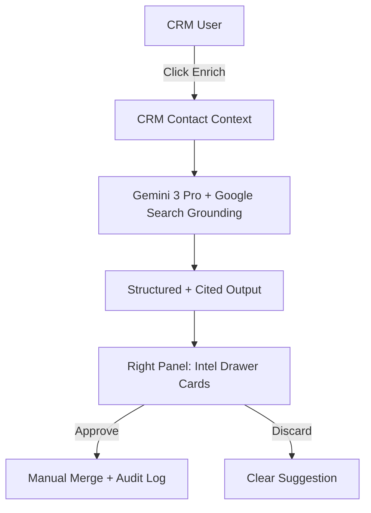

# 🧠 FashionOS CRM Enrichment: Grounded Intelligence System

**Version:** 1.0.0 (Intel Drawer Phase)  
**Status:** 🗺️ PLANNING PHASE (Non-Implementation)  
**Objective:** Design a "Deep Research" enrichment engine for luxury fashion contacts using Gemini 3 Pro and Google Search Grounding.

---

## 🎯 1. Objective & Philosophy
To transform the FashionOS CRM from a static database into a **Living Intelligence Network**. The system enriches contacts with verifiable, real-world data while maintaining a "Quiet Luxury" aesthetic and human-first control.

- **Human-First:** AI proposes; humans commit.
- **Grounded:** Every fact must be backed by a cited Google Search source.
- **Preview-Only:** Data never auto-writes to the primary record without a manual "Apply" action.

---

## 🧩 2. Fashion-Specific Use Cases

### 1️⃣ Strategic Partner Enrichment
- **Identity:** Verify current role (e.g., "Has this Editor moved from Vogue to Harper's?").
- **Activity:** Detect attendance at recent Fashion Weeks (Paris, Milan, London, NY).
- **Influence:** Identify recent public collaborations, awards, or brand alignments.

### 2️⃣ Media Resonance Tracking
- **Press Monitoring:** For Press contacts, verify recent articles mentioning the brand or its competitors.
- **Sentiment Audit:** Automatically classify press mentions as *Positive*, *Neutral*, or *Critical*.

### 3️⃣ Network Credibility Signals
- Detect public associations with major luxury conglomerates (LVMH, Kering, Richemont).
- Identify "Tier I" indicators based on global press volume and showroom activity.

---

## 🧱 3. System Architecture & Intelligence Loop

### The "Intel Drawer" Workflow
1.  **Trigger:** User selects a contact and clicks **"Enrich Node"** in the Right Panel.
2.  **Context Gathering:** System packages the current CRM record (Name, Role, Company, City).
3.  **Grounded Query:** Gemini 3 Pro executes a Google Search Grounding request.
4.  **Structured Analysis:** Gemini parses search results into a strict JSON schema.
5.  **Preview Render:** Right Panel displays "Proposed Updates" vs "Current Data".
6.  **Human Decision:** User clicks "Apply" to merge specific fields or "Dismiss" to ignore.



---

## 📥 4. Input & Output Contracts

### A. Input Context (Package)
```json
{
  "contact": {
    "name": "Sarah Jenkins",
    "role": "Head Buyer",
    "company": "Harrods",
    "location": "London, UK",
    "category": "Buyer"
  },
  "brandContext": {
    "brandName": "FashionOS Client Maison",
    "currentSeason": "SS25"
  }
}
```

### B. Structured Output Schema (JSON)
```json
{
  "profileVerification": {
    "currentRoleConfirmed": true,
    "organization": "Harrods",
    "confidence": "high",
    "sources": [
      {
        "title": "Harrods Buying Team Update 2025",
        "url": "https://voguebusiness.com/...",
        "date": "2025-03-10"
      }
    ]
  },
  "recentActivities": [
    {
      "type": "fashion_show",
      "event": "Paris Fashion Week SS25",
      "date": "2025-02-28",
      "source": "https://wwd.com/..."
    }
  ],
  "networkSignals": {
    "influenceTier": "Tier I",
    "notes": "Confirmed Front Row attendee at Chanel and Dior SS25."
  },
  "confidenceScore": 0.94
}
```

---

## 🖥️ 5. Right Panel UI: The "Intel Drawer"

The UI must feel like a high-density intelligence briefing, not a generic form.

### A. Layout Rules
- **Sticky Header:** Title "Enrichment" with a "Verified" badge count.
- **Before/After Cards:** Clearly show `Current Value` → `Suggested Value` with a checkbox.
- **Source Chips:** Every card shows clickable chips (e.g., `Vogue`, `WWD`, `LinkedIn`) leading directly to sources.
- **Status Pills:** 
  - ✅ **Verified:** Data matches source perfectly.
  - ⚠️ **Mismatch:** Source suggests a different role/company.
  - 🕒 **Stale:** Source is > 12 months old.

### B. Core Cards
1.  **Identity Verification:** Compares Role/Company/City.
2.  **Fashion Signals:** Timeline of recent show attendance and RSVPs found in public press.
3.  **Media Mentions:** List of recent articles/interviews with sentiment analysis.
4.  **Strategic Next Actions:** AI-suggested follow-ups (e.g., "Congratulate on recent promotion at Harrods").

---

## 🔐 6. Safety & Trust Rules
- **No Auto-Writing:** Gemini cannot modify the database directly.
- **Mandatory Citations:** No data card is rendered without at least one verifiable source URL.
- **Audit Trail:** When a user clicks "Apply", a log entry is created: *"Enrichment applied via AI (Source: WWD.com)"*.
- **Privacy First:** Only public search data is used; no private scraping or PII harvesting beyond professional role/alignment.

---

## 🏁 7. Success Criteria
- **Zero Hallucination:** Every field is backed by a grounding chunk.
- **Speed:** Enrichment completes in < 4 seconds using Gemini 3 Flash for extraction.
- **Aesthetic:** Right panel maintains "Quiet Luxury" during loading and preview states.
- **User Agency:** One-click "Apply" vs. "Dismiss" on a per-field basis.

---

## 📦 8. Final Statement on Tools
- **Grounding with Google Search:** MANDATORY.
- **Interactions API:** NOT USED in v1.
- **Manual Verification:** Required for all applied updates.