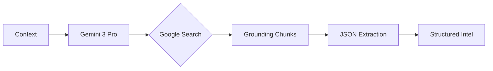
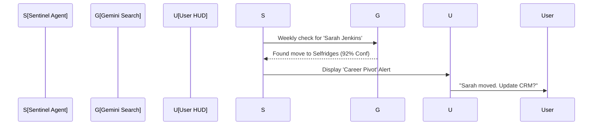

# 🧠 FashionOS CRM Enrichment: Implementation Roadmap

**Architect:** Senior Product Architect / UX Systems Engineer

---

## 📊 Progress Tracker

| Step | Focus | Implementation Prompt | Status |
| :--- | :--- | :--- | :--- |
| 1 | UI Foundation | The "Intel Drawer" HUD & Entry States | 🟢 COMPLETED |
| 2 | Core Logic | Gemini 3 Pro + Search Grounding Service | 🟢 COMPLETED |
| 3 | Verification UX | "Before/After" Comparison & Citation Cards | 🟢 COMPLETED |
| 4 | Persistence | Structured Merge Logic & Audit Logging | 🟢 COMPLETED |
| 5 | Proactive Agents | Background Sentinel & Market Change Alerts | ⏳ PENDING |

---

## 🪜 Step 1: UI Foundation & Entry States
**Goal:** Create the visual entry point for enrichment within the Right Panel (Intelligence) using a "Quiet Luxury" aesthetic.

### Tasks & Steps
1. **Header Refinement:** Update `CRMContactPanel.tsx` header to include a "✨ Enrich" button with a subtle pulse animation if the node hasn't been updated in >30 days.
2. **Loading States:** Implement a high-fidelity "Neural Processing" skeleton screen that mimics a scanner reading a dossier.
3. **Empty State:** Design a "No Intel" card that encourages the user to trigger the first enrichment scan.

### Logic & Workflows
- **Trigger:** Button click emits a `trigger-enrichment` event.
- **Context:** Pass `Contact` ID and current metadata to the parent container.

### Success Criteria
- UI remains responsive during "scanning" simulation.
- Transition from "Static Profile" to "Enrichment Preview" is seamless (0.3s ease-in-out).

### Production Checklist
- [x] Lucide Icons: `Sparkles`, `Zap`, `RefreshCw`.
- [x] Tailwind: `animate-pulse` for the scanner effect.
- [x] Z-index: Ensure modals/drawers don't overlap awkwardly.

---

## 🪜 Step 2: Gemini 3 Pro Grounding Service
**Goal:** Implement the backend service that orchestrates Google Search Grounding and structured output.

### Tasks & Steps
1. **Service Expansion:** Add `enrichContactNode` to `geminiService.ts`.
2. **Grounding Configuration:** Configure Gemini 3 Pro with `googleSearch` tool and a strict JSON response schema.
3. **Prompt Engineering:** Create a multi-step prompt that instructs Gemini to:
    - Verify current role/company.
    - Find the 3 most recent fashion show attendances.
    - Identify recent press mentions with sentiment.
    - Calculate a confidence score.

### Logic & Workflows

### Success Criteria
- Response contains at least 3 verifiable source URLs.
- Confidence score is provided as a number (0-1).

---

## 🪜 Step 3: Verification & Citation UI
**Goal:** Build the "Before vs. After" interface that allows users to audit AI-suggested changes.

### Tasks & Steps
1. **Comparison Cards:** Create `EnrichmentCardRoleVerification.tsx` (Inlined in CRMContactPanel) showing a side-by-side view: `Current: Editor @ Vogue` vs `AI: Editor @ WWD`.
2. **Citation Chips:** Render clickable chips for every grounding source.
3. **Conflict UI:** Highlight fields in Amber where the AI suggestion differs significantly from the current record.

### Logic & Workflows
- Users can toggle individual checkboxes for each suggested field.
- Citations must open in a new tab without losing the "Intel Drawer" state.

### Final Validation
- Verify that clicking "Source" takes the user to a valid article URL.
- Verify "Mismatch" warnings trigger only when confidence is >0.7 but data differs.

---

## 🪜 Step 4: Merge Logic & Audit Logging
**Goal:** Ensure that applying enrichment is safe, persistent, and auditable.

### Tasks & Steps
1. **Functional Merge:** Create a `handleApplyEnrichment` function (Event-based update-contact) in `CRM.tsx` that updates the local state.
2. **Audit Entry:** Automatically generate an `InteractionLog` of type `Note` detailing: "Enrichment applied. Sources: [URLs]".
3. **Status Update:** Update the contact's `lastContact` or `status` if a major role change is confirmed.

### Production Checklist
- [x] Immutable State: Use `setContacts(prev => ...)` correctly.
- [x] Confirmation Sheet: Show "You are updating 4 fields. Confirm?"
- [x] Error Handling: Handle "Partial Merge" scenarios.

---

## 🪜 Step 5: Proactive Sentinel Agent
**Goal:** Implement an agentic workflow that alerts users when a partner’s market status changes externally.

### Tasks & Steps
1. **Sentinel Logic:** Create a background effect that periodically runs a "Market Signal" check for "Tier I" contacts.
2. **Alert HUD:** If a major change is found (e.g., job move), show a floating "Intel Alert" in the Dashboard.
3. **Wizard Flow:** Clicking the alert opens a "Update Career Path" wizard.

### Logic & Workflows

### Final Validation
- Ensure background checks do not exceed API rate limits.
- Verify alerts are dismissed properly after enrichment is applied.

---

## 🧾 Production-Ready Summary
- **Model:** Gemini 3 Pro (Reasoning) / Gemini 3 Flash (Extraction).
- **Tools:** Google Search Grounding, Structured Outputs.
- **UX:** 3-Panel Consistency, Source Transparency.
- **Safety:** Human-in-the-loop merge, explicit audit trails.