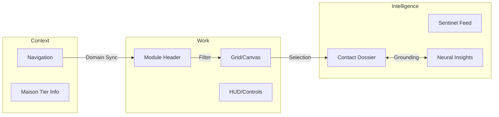
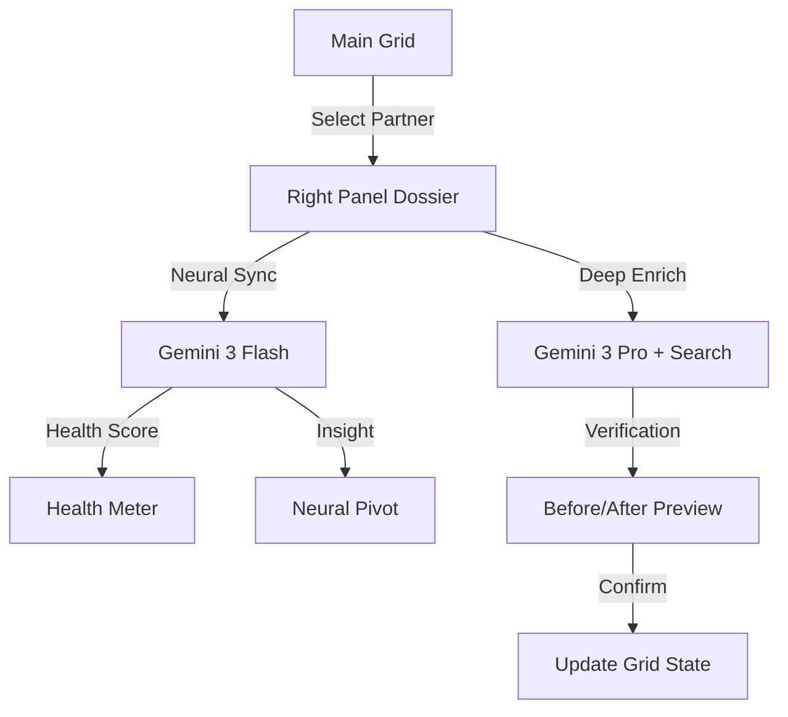

# 🗺️ FashionOS System Map & Architecture

**Version:** 2.0.0 (Neural Mesh)
**Status:** PRODUCTION READY
**Philosophy:** Quiet Luxury, Intelligence-First, 3-Panel Consistency.

---

## 🌳 System Tree

```text
FashionOS (Root)
├── 🟦 Left: Context (Navigation)
│   ├── Dashboard (Command Center)
│   ├── CRM (Relationship Mesh)
│   ├── Analysis (Market Intelligence)
│   ├── Profile (Brand DNA)
│   ├── Calendar (Time Logistics)
│   ├── Shoots (Production)
│   ├── Events (Experience)
│   ├── Campaigns (Deployment)
│   ├── Media (Asset Library)
│   ├── Concierge (AI Interface)
│   └── Settings (System Config)
│
├── 🟩 Main: Work (Execution)
│   ├── [Dashboard] -> Hero Metrics, Critical Path, Resonance Chart
│   ├── [CRM] -> Partner Grid, Filter HUD, Handshake Modals
│   ├── [Analysis] -> Social Resonance, Style Radar, Global Share
│   └── [Initializing Domains] -> Neural Mesh Loading State
│
└── 🟨 Right: Intelligence (Perspective)
    ├── Sentinel Feed (Proactive Alerts)
    ├── Neural Insights (Contextual AI)
    ├── Collaborative Stream (Team Activity)
    └── [Context: CRM Selection] -> Deep Dossier, Health Meter, Grounded Signals
```

---

## 🛣️ Routing & State Logic

FashionOS uses a **State-Based Navigation** model rather than traditional URL routing to maintain the "Single-App Experience" required for high-density creative work.

| Trigger | State Change | UI Impact |
| :--- | :--- | :--- |
| **Sidebar Click** | `setActiveItem(NavigationItem)` | Main Panel re-renders; Right Panel resets to Module Intelligence. |
| **CRM Row Click** | `setSelectedContactId(string)` | Right Panel transitions from Sentinel Feed to **Contact Dossier**. |
| **Enrich Click** | `setIsEnriching(true)` | Right Panel runs Grounded Search; Renders Before/After comparison. |
| **Search (⌘K)** | `setSearchQuery(string)` | Main Panel grid filters in real-time. |

---

## 🗺️ Architectural Diagrams

### 1. The 3-Panel Unified Model


### 2. CRM Intelligence Workflow


---

## 🏃 User Journeys (Production Use-Cases)

### 1. The "Dossier Verification" (Discovery & Trust)
*User needs to verify if a Harrods Buyer is still in their role before sending an exclusive invite.*
1. **Discover:** User selects "Julian Thorne" in the CRM Grid.
2. **Observe:** The Right Panel opens his Dossier. The Health Meter shows "Stable (64%)".
3. **Trigger:** User clicks **Deep Enrich**.
4. **Research:** Gemini executes a grounded search, identifying Julian has moved to **Selfridges**.
5. **Verify:** User reviews the side-by-side comparison and citations from *Vogue Business*.
6. **Commit:** User clicks **Apply Intelligence**. The CRM updates, and a "Career Pivot" log is added to the timeline.

### 2. The "Market Resonance Pivot" (Crisis & Opportunity)
*User notices a dip in social reach in the APAC region.*
1. **Analyze:** User navigates to **Analysis**. The Style Radar shows the brand is "Drifting" from APAC minimalism trends.
2. **Consult:** User looks at the **Right Panel**. The AI suggests: *"Shift SS25 media allocation to Tokyo-based street-luxury influencers."*
3. **Act:** User navigates to **Campaigns** to adjust distribution logic based on the AI's trend analysis.

### 3. The "Sentinel Alert" (Proactive Response)
*A critical news event occurs regarding a key Maison partner.*
1. **Alert:** While the user is in **Media**, the Sentinel Feed (Right Panel) pulses Amber.
2. **Read:** Alert: *"Conflict Detected: Editor Elena Vance now aligned with Competitor X."*
3. **Pivot:** User clicks the alert, which jumps them to Elena's CRM Profile, where a "Strategic Warning" provides a pre-drafted response to maintain relationship integrity.

---

## ✅ System Integrity Checklist
- [x] **No Ghost States:** Navigation resets selected context when switching domains.
- [x] **Grounded Data:** Every intelligence card includes a verifiable source URL.
- [x] **Calm UI:** Transitions between panels use 0.5s ease-in-out animations to prevent jarring shifts.
- [x] **Zero Data Loss:** CRM updates are persisted to LocalStorage immediately on "Apply".